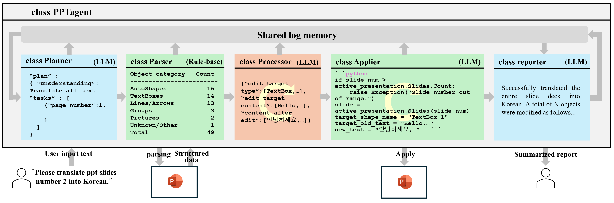

# PPTAgent


# 🚀 PPT Agent

<div align="center">
  
  
  
  **자동으로 프레젠테이션을 생성하고 관리하는 AI 기반 솔루션**
  
  [](https://github.com/yourusername/ppt-agent/stargazers)
  [](LICENSE)
  [](https://youtu.be/your-demo-link)
  
</div>

## 📖 개요

PPT Agent는 인공지능 기술을 활용하여 고품질 프레젠테이션을 자동으로 생성하고 관리하는 혁신적인 도구입니다. 사용자의 콘텐츠와 요구 사항에 맞춰 최적화된 프레젠테이션을 제작하여 시간을 절약하고 전문적인 결과물을 얻을 수 있습니다.

## ✨ 주요 기능

- **🤖 AI 기반 콘텐츠 생성**: 간단한 프롬프트만으로 프레젠테이션 내용을 자동 생성
- **🎨 스마트 디자인 적용**: 콘텐츠에 맞는 테마와 레이아웃 자동 추천
- **📊 데이터 시각화**: 복잡한 데이터를 이해하기 쉬운 차트와 그래프로 변환
- **🔄 실시간 편집**: 사용자 피드백에 따라 프레젠테이션을 즉시 수정
- **📱 다양한 플랫폼 지원**: PC, 모바일, 웹 환경에서 모두 사용 가능
### Overall


## 🎬 데모 영상

<div align="center">
  
  [](https://www.youtube.com/watch?v=your-video-id "PPT Agent 데모 영상")
  
  [YouTube에서 전체 데모 보기](https://youtu.be/your-demo-link)
  
</div>

## 🛠️ 설치 방법
### recommend python in Windows.

### conda environment
```bash
pip install -r 'requirements.txt'
```
- Then make 'credentials.yml' on pptagent-4.16/pptagent.
you should make like below.
```yml
gpt-4.1-mini:
  api_key:  "YOUR_OPENAI_API_KEY"
  base_url: "https://api.openai.com/v1"
gpt-4.1-nano:
  api_key:  "YOUR_OPENAI_API_KEY"
  base_url: "https://api.openai.com/v1"
gemini-1.5-flash:
  api_key: "YOUR_GEMINI_API_KEY"
```
- .env file in pptagent
```bash
python pptagent/main.py
```

## 📚 문서

자세한 문서는 [공식 문서](https://yourusername.github.io/ppt-agent/docs)에서 확인할 수 있습니다.

## 🔍 기술 스택

- **프론트엔드**: React, TypeScript, Styled Components
- **백엔드**: Node.js, Express
- **AI 모델**: GPT-4, DALL-E 3
- **기타**: PowerPoint API, Google Slides API

## 🧪 연구 논문

저희 PPT Agent에 관한 연구 논문이 곧 출판될 예정입니다! 최신 AI 기반 프레젠테이션 생성 기술에 대한 심층적인 내용을 다루고 있으니 많은 기대 부탁드립니다.

> **논문 출판 소식은 [Twitter](https://twitter.com/yourusername)와 [연구 블로그](https://yourusername.github.io/blog)에서 가장 먼저 확인하실 수 있습니다.**

## 📊 인용 방법

PPT Agent를 연구나 프로젝트에 활용하실 경우, 다음과 같이 인용해 주세요:

```bibtex
@software{ppt_agent2025,
  author = {Your Name},
  title = {PPT Agent: AI-Powered Presentation Generator},
  url = {https://github.com/yourusername/ppt-agent},
  version = {1.0.0},
  year = {2025},
}
```

또는 다음과 같이 간략하게 인용할 수도 있습니다:

```
Your Name. (2025). PPT Agent: AI-Powered Presentation Generator [Software]. Available from https://github.com/yourusername/ppt-agent
```

## 🤝 기여하기

PPT Agent는 오픈소스 프로젝트로, 모든 기여를 환영합니다! 기여 방법에 대한 자세한 내용은 [CONTRIBUTING.md](CONTRIBUTING.md)를 참조하세요.

## 📄 라이센스

이 프로젝트는 MIT 라이센스 하에 배포됩니다. 자세한 내용은 [LICENSE](LICENSE) 파일을 참조하세요.

## 📬 연락처

- **이메일**: your.email@example.com
- **트위터**: [@yourusername](https://twitter.com/yourusername)
- **웹사이트**: [yourwebsite.com](https://yourwebsite.com)

---

<div align="center">
  <p>🌟 PPT Agent로 더 스마트하게 프레젠테이션을 만들어보세요! 🌟</p>
  <p>Made with ❤️ by Your Name</p>
</div>